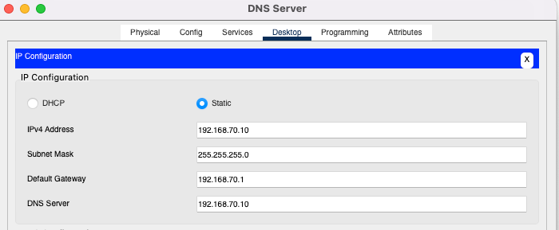
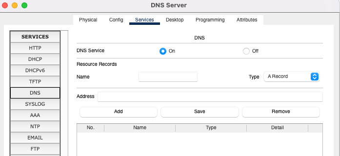
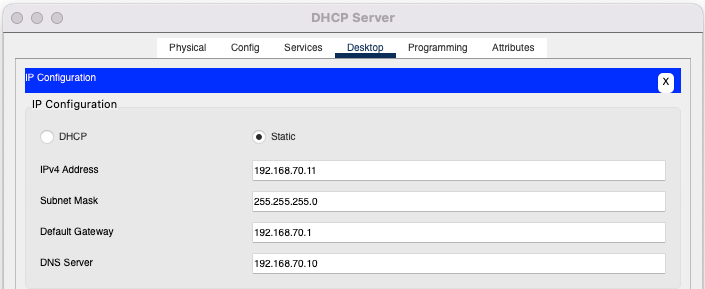
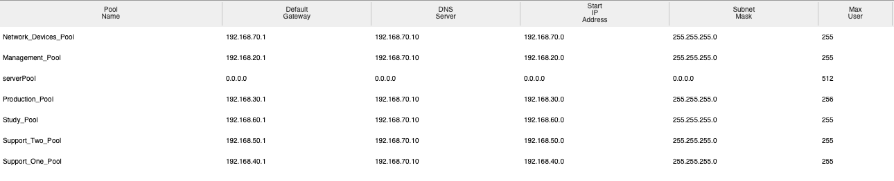

Making the whole network without config anything
Config each interface from routers to switches : 

Eth5/0 : 
ip address 192.168.70.1 255.255.255.0

Eth6/0 : 
ip address 192.168.20.1 255.255.255.0

Eth7/0 : 
ip address 192.168.30.1 255.255.255.0

Eth8/0 : 
ip address 192.168.60.1 255.255.255.0

Eth9/0 : 
ip address 192.168.40.1 255.255.255.0

Fa0/0 :
not yet configured , goes to dmz , will configure later

Fa1/0 : 
ip address 192.168.50.1 255.255.255.0

Config DNS server : 

Nothing inside yet but we'll see later what we need. 

Config DHCP server : 

Created all DHCP pool: 

Activated DHCP delay on each router interface : 

ip address-helper 192.168.70.11

