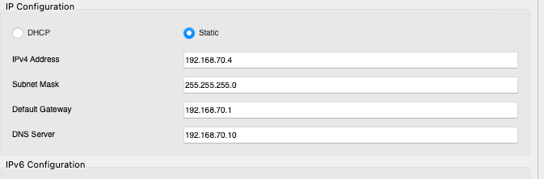

On each subnet switch , I created the appropriate vlan and assigned a name to them. Then I assigned every ports from those switch to their VLANs.

Switch DMZ :

```scss
Switch(config)# vlan 10
Switch(config-vlan)# name DMZ

Switch(config)# interface <interface_type> <interface_number> Switch(config-if)# switchport mode access 
Switch(config-if)# switchport access vlan 10
```

Switch Management :

```scss
Switch(config)# vlan 20
Switch(config-vlan)# name Management

Switch(config)# interface <interface_type> <interface_number> Switch(config-if)# switchport mode access 
Switch(config-if)# switchport access vlan 20
```

Switch Production : 

```scss
Switch(config)# vlan 30
Switch(config-vlan)# name Production

Switch(config)# interface <interface_type> <interface_number> Switch(config-if)# switchport mode access 
Switch(config-if)# switchport access vlan 30
```

Switch Support 1 :

```scss
Switch(config)# vlan 40
Switch(config-vlan)# name SupportOne

Switch(config)# interface <interface_type> <interface_number> Switch(config-if)# switchport mode access 
Switch(config-if)# switchport access vlan 40
```

Switch Support 2 :

```scss
Switch(config)# vlan 50
Switch(config-vlan)# name SupportTwo

Switch(config)# interface <interface_type> <interface_number> Switch(config-if)# switchport mode access 
Switch(config-if)# switchport access vlan 50
```

Switch Study :

```scss
Switch(config)# vlan 60
Switch(config-vlan)# name Study

Switch(config)# interface <interface_type> <interface_number> Switch(config-if)# switchport mode access 
Switch(config-if)# switchport access vlan 60
```

Switch Network Devices :

```scss
Switch(config)# vlan 70
Switch(config-vlan)# name NetworkDevices

Switch(config)# interface <interface_type> <interface_number> Switch(config-if)# switchport mode access 
Switch(config-if)# switchport access vlan 70
```

Then I configured the router : 

First I tried to config the vlans subinterfaces but I realised that I needed to delete the gateway that I previously attributed to each interface. 

Example : 

interface FastEthernet5/0
no ip address

Then I could create my vlans subinterfaces : 

interface FastEthernet1/0.50
 encapsulation dot1Q 50
 ip address 192.168.50.1 255.255.255.0
 ip helper-address 192.168.70.11


interface Ethernet5/0.70
 encapsulation dot1Q 70
 ip address 192.168.70.1 255.255.255.0
 ip helper-address 192.168.70.11

interface Ethernet6/0.20
 encapsulation dot1Q 20
 ip address 192.168.20.1 255.255.255.0
 ip helper-address 192.168.70.11

interface Ethernet7/0.30
 encapsulation dot1Q 30
 ip address 192.168.30.1 255.255.255.0
 ip helper-address 192.168.70.11

interface Ethernet8/0.60
 encapsulation dot1Q 60
 ip address 192.168.60.1 255.255.255.0
 ip helper-address 192.168.70.11

interface Ethernet9/0.40
 encapsulation dot1Q 40
 ip address 192.168.40.1 255.255.255.0
 ip helper-address 192.168.70.11

Then I realised I needed trunking from each switch to the router.
So I went to each switch cli : 

switchport mode trunk
switchport trunk allowed vlan all

So now each switch has a trunk that allows all the vlans from the router and it allows data to be transferred from one vlan to an other and now any host can make a ping to any other host in the whole network or make a dhcp request to the subnet VLAN 70 where the dhcp server is hosted.


For the ISCI server , since we can't make it in cisco packet tracer I will fake it by enabling FTP and TFTP on the network with this server. So i changed the server address to static : 



Then I went back to the DHCP configuration and put the ISCI server ip in the TFTP configuration for each DCHP Pool : 192.168.70.4

You can check that FTP is working by accessing a computer's cmd and typing : 

ftp 192.168.70.4

and the logins are : 

admin / admin => admin account

management / management
production / production 
support / support                              ==> per sector credentials
study / study
dmz / dmz

